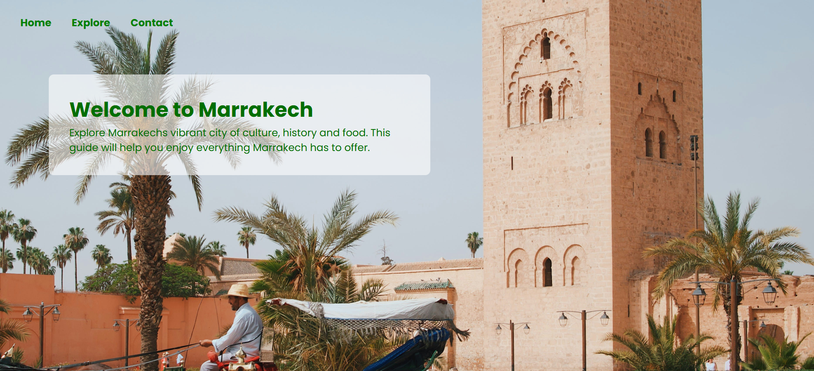
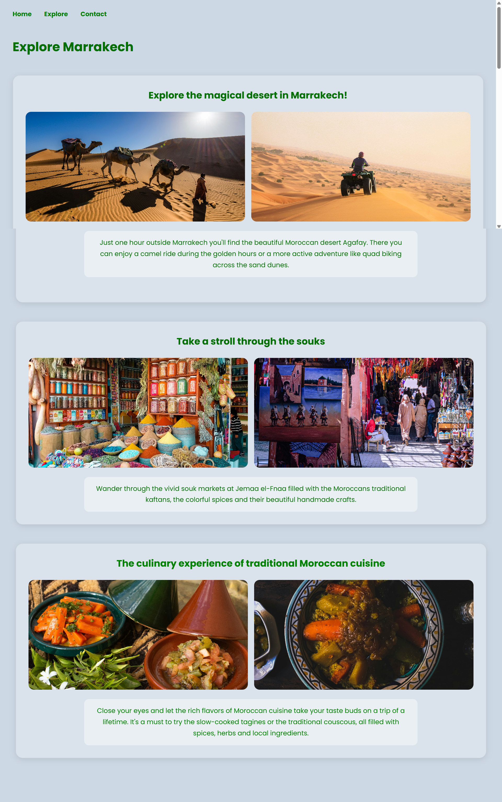
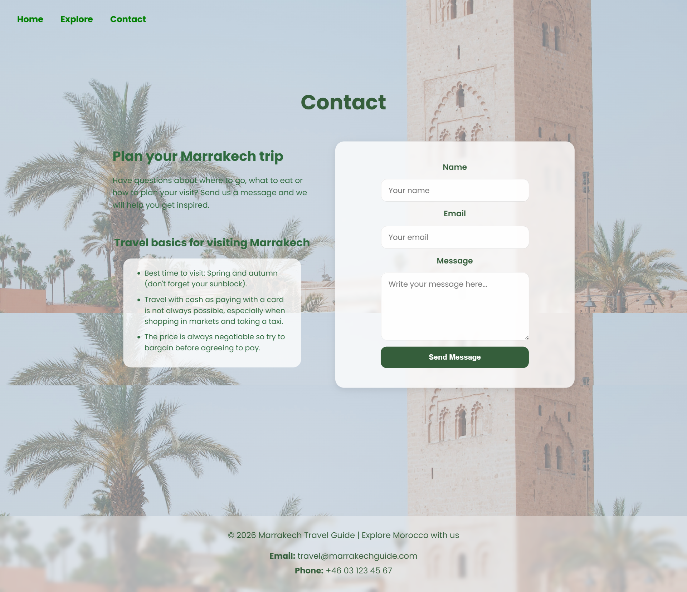
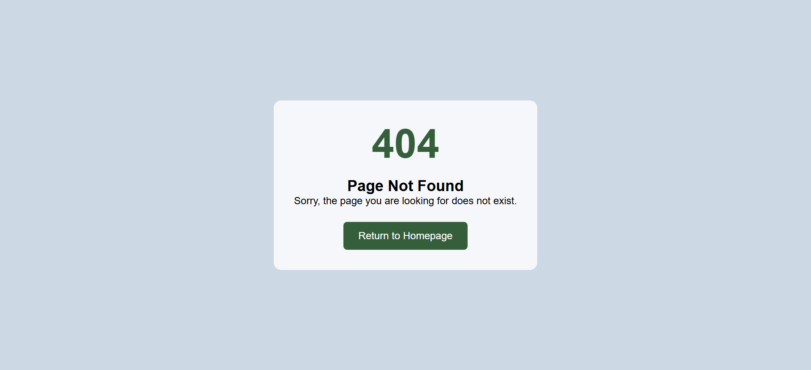

# Marrakech Travel Guide

[View the live website](https://monia07.github.io/Marrakech-travel-guide/)

Marrakech Travel Guide is a responsive front-end website created with HTML, CSS and a small amount of JavaScript. The website introduces users to Marrakech as a travel destination and provides inspiration, travel information and a simple contact form.

The project was created for users who are interested in visiting Marrakech and want a simple, visual guide to the city’s culture, desert experiences, souks and food.

## Project Rationale

I chose Marrakech as the topic because I have a strong interest in travel, culture and Morocco as a destination. Morocco has also gained increased global attention after the national football team reached fourth place in the FIFA World Cup 2022. The country will also be one of the host nations for the FIFA World Cup 2030, which makes it even more relevant as a travel destination.

The aim of the website is to provide a clear, visually appealing and easy-to-use travel guide. The design is image-focused, with colours inspired by the main Marrakech image on the homepage. The green text and soft blue-grey background were chosen to create a calm and consistent visual identity across the site.

## UX

### Strategy

**Purpose**

- Inspire users to explore Marrakech.
- Present key travel experiences such as the desert, souks and Moroccan cuisine.
- Provide practical travel tips and a way for users to get in contact.

**Primary User Needs**

- Understand the purpose of the website immediately.
- Navigate easily between pages.
- View travel inspiration and useful information.
- Use the contact form to send a message.

**Site Goals**

- Create a clear and responsive travel guide.
- Use accessible colour contrast and readable typography.
- Present content in a structured and visually consistent way.

### Scope

The website includes:

- A homepage with a hero image and welcome message.
- An Explore page with travel experience cards.
- A Contact page with travel basics, a contact form and footer contact details.
- Responsive styling for mobile, tablet and desktop.

### Structure

The site has three main pages:

| Page    | Purpose                                                        |
| ------- | -------------------------------------------------------------- |
| Home    | Introduces Marrakech and sets the visual style of the website. |
| Explore | Presents desert activities, souks and Moroccan cuisine.        |
| Contact | Provides travel tips, contact information and a contact form.  |

The navigation menu appears on all pages and allows users to move between the main areas of the site.

### Skeleton

The layout was planned around a simple three-page structure. The homepage uses a large hero image. The Explore page uses structured travel cards. The Contact page uses a two-column layout with travel information and a form.

### Surface

The website uses a calm travel-inspired colour palette:

- `#ccd8e4` as the main soft blue-grey background colour.
- `#355e3b` and `#2f6b3f` as the main green text and button colours.
- Semi-transparent white and blue-grey cards to create a light, modern layout.

## Typography

The website uses [Poppins](https://fonts.google.com/specimen/Poppins) from Google Fonts. Poppins was chosen because it is modern, clean and easy to read, giving the website a more professional travel-guide feel.

## User Stories

| Target                  | Expectation                                                | Outcome                                                |
| ----------------------- | ---------------------------------------------------------- | ------------------------------------------------------ |
| As a first-time visitor | I want to understand what the website is about immediately | so that I know I am viewing a Marrakech travel guide.  |
| As a traveller          | I want to explore popular experiences in Marrakech         | so that I can get ideas for my trip.                   |
| As a traveller          | I want to view images of activities and food               | so that I can better understand what Marrakech offers. |
| As a user               | I want clear navigation                                    | so that I can move between pages easily.               |
| As a user               | I want the site to work on mobile and desktop              | so that I can use it on any device.                    |
| As a user               | I want practical travel tips                               | so that I feel more prepared before visiting.          |
| As a user               | I want to send a message through a form                    | so that I can request more travel information.         |

## Features

Feature screenshots can be found in:

```text
documentation/features/
```

### Navigation

The navigation menu appears across the website and links to Home, Explore and Contact. It is clear and simple, allowing users to move between pages intuitively.



### Homepage Hero

The homepage uses a large Marrakech image with a welcome message. This immediately communicates the purpose and visual identity of the website.


### Explore Travel Cards

The Explore page contains three travel-card sections:

- Desert experience
- Souks and markets
- Moroccan cuisine

Each section includes images, descriptive text and hover effects to make the page feel more interactive and professional.



### Contact Form

The Contact page includes a simple contact form with name, email and message fields. When the user submits the form, a success message is displayed using JavaScript.



### Custom 404 Page

A custom 404 page was created to improve user experience when users navigate to invalid or missing URLs.



## Future Features

Future improvements could include:

- More detailed travel guides for specific areas of Marrakech.
- A gallery page with more destination images.
- Interactive map locations for attractions.
- A booking enquiry system connected to a backend.
- More destination categories such as hotels, cafés and day trips.
- A FAQ section for common travel questions.

## Tools and Technologies

| Tool / Tech          | Use                                          |
| -------------------- | -------------------------------------------- |
| HTML5                | Structure and page content                   |
| CSS3                 | Styling, layout and responsive design        |
| JavaScript           | Contact form success message                 |
| Google Fonts         | Poppins typography                           |
| Git                  | Version control                              |
| GitHub               | Repository hosting                           |
| GitHub Pages         | Live deployment                              |
| VS Code              | Code editor                                  |
| W3C Validator        | HTML validation                              |
| Jigsaw CSS Validator | CSS validation                               |
| CompressPNG          | Image compression                            |
| ChatGPT              | Learning support, debugging and explanations |

This project does not use Bootstrap or any CSS framework. All styling was written using custom CSS.

## Testing

Detailed testing documentation can be found in:

```text
TESTING.md
```

Validation screenshots can be found in:

```text
documentation/validation/
documentation/responsiveness/
documentation/features/
```

### Manual Testing

Testing was carried out manually throughout development and before final deployment.

| Feature         | Test                                  | Expected Result                                  | Actual Result             | Status |
| --------------- | ------------------------------------- | ------------------------------------------------ | ------------------------- | ------ |
| Navigation      | Click Home, Explore and Contact links | Correct page opens                               | Pages open correctly      | Pass   |
| Home page       | Load homepage                         | Hero image and welcome text display correctly    | Displayed correctly       | Pass   |
| Explore page    | View all travel cards                 | Images, headings and text display clearly        | Displayed correctly       | Pass   |
| Contact page    | View contact layout                   | Form, travel basics and footer display correctly | Displayed correctly       | Pass   |
| Contact form    | Submit form with valid inputs         | Success message appears and form resets          | Success message appears   | Pass   |
| Success message | Submit contact form                   | Confirmation message appears without page reload | Displayed correctly       | Pass   |
| Images          | Check all images                      | Images load and are not stretched                | Images display correctly  | Pass   |
| Footer          | View footer on contact page           | Contact info appears clearly                     | Footer displays correctly | Pass   |

### Responsiveness Testing

Responsive layout screenshots can be found in:

```text
documentation/responsiveness/
```

The website was tested using browser developer tools at mobile, tablet and desktop sizes.

| Device Size | Expected Result                                       | Actual Result             | Status |
| ----------- | ----------------------------------------------------- | ------------------------- | ------ |
| Mobile      | Content stacks vertically and remains readable        | Layout adapts correctly   | Pass   |
| Tablet      | Content remains balanced without horizontal scrolling | Layout adapts correctly   | Pass   |
| Desktop     | Images and cards display in a wider layout            | Layout displays correctly | Pass   |

### Validator Testing

| Validator            | File         | Result                    |
| -------------------- | ------------ | ------------------------- |
| W3C HTML Validator   | index.html   | Passed                    |
| W3C HTML Validator   | explore.html | Passed after syntax fixes |
| W3C HTML Validator   | contact.html | Passed after syntax fixes |
| Jigsaw CSS Validator | style.css    | Passed                    |

### Lighthouse Testing

Lighthouse screenshots can be found in:

```text
documentation/validation/
```

Lighthouse testing was performed in Google Chrome DevTools.

The website achieved good results in:

- Performance
- Accessibility
- Best Practices
- SEO

Images were compressed to improve loading performance.

### Browser Compatibility

The website was tested and works correctly on:

- Google Chrome
- Microsoft Edge
- Samsung Internet Browser

The website was also tested on different screen sizes including:

- Mobile devices
- Tablets
- Desktop screens

### Bugs Found and Fixed

| Bug                                                 | Cause                                     | Fix                                                    |
| --------------------------------------------------- | ----------------------------------------- | ------------------------------------------------------ |
| Contact page failed HTML validation                 | Missing closing tags                      | Corrected HTML syntax                                  |
| Explore page failed HTML validation                 | Incorrect semantic structure              | Replaced invalid elements and corrected structure      |
| Images did not display on GitHub Pages              | Uppercase filenames caused path issues    | Renamed image files using lowercase filenames          |
| Mobile contact page layout broke on smaller screens | Missing responsive styling                | Added responsive media queries                         |
| Images loaded slowly                                | Large image file sizes                    | Compressed image sizes                                 |
| GitHub Pages returned 404 image errors              | Incorrect image paths and filename casing | Corrected image paths and filenames                    |
| Contact form success message did not display        | JavaScript functionality missing          | Added submit event listener and hidden success message |

### Remaining Bugs

No known unfixed bugs remain at the time of submission.

## Deployment

The website was deployed using GitHub Pages.

### GitHub Pages Deployment

1. The project files were committed and pushed to GitHub.
2. In the GitHub repository, I opened the **Settings** tab.
3. I selected **Pages** from the sidebar.
4. Under **Build and deployment**, I selected **Deploy from a branch**.
5. I selected the **main** branch and the **root** folder.
6. I clicked **Save**.
7. GitHub Pages generated the live deployment link.

Live site: [Marrakech Travel Guide](https://monia07.github.io/Marrakech-travel-guide/)

### Local Development

To run the project locally:

1. Go to the GitHub repository.
2. Click the green **Code** button.
3. Copy the repository URL.
4. Open a terminal.
5. Run:

```bash
git clone https://github.com/Monia07/Marrakech-travel-guide.git
```

6. Open the project folder in VS Code.
7. Open `index.html` in the browser.

Alternatively, use the Live Server extension in VS Code.

### Forking

To fork the project:

1. Log in to GitHub.
2. Go to the repository.
3. Click the **Fork** button.
4. GitHub will create a copy of the repository in your account.

## Credits

### Content

All written content was created for this project and adapted to match the Marrakech travel theme.

### Code

Most code was written specifically for this project using HTML, CSS and a small amount of JavaScript.

| Source                                                    | Notes                                                       |
| --------------------------------------------------------- | ----------------------------------------------------------- |
| [Google Fonts](https://fonts.google.com/specimen/Poppins) | Poppins font used throughout the website                    |
| [ChatGPT](https://chatgpt.com)                            | Used as learning support for debugging, layout explanations |

### Media

Images were sourced from Unsplash and used in accordance with the Unsplash license.

| Media             | Source   |
| ----------------- | -------- |
| Marrakech image   | Unsplash |
| Camel image       | Unsplash |
| Quad biking image | Unsplash |
| Souk images       | Unsplash |
| Tagine image      | Unsplash |
| Couscous image    | Unsplash |

### Image Compression

Images were compressed using CompressPNG to improve loading performance.

## AI Usage Disclosure

AI tools were used as learning support during development, mainly for understanding HTML/CSS concepts and debugging layout issues.

## Acknowledgements

- Code Institute for the project structure guidance and learning materials.
- My Code Institute mentor Tim Nelson for feedback and guidance during development.
